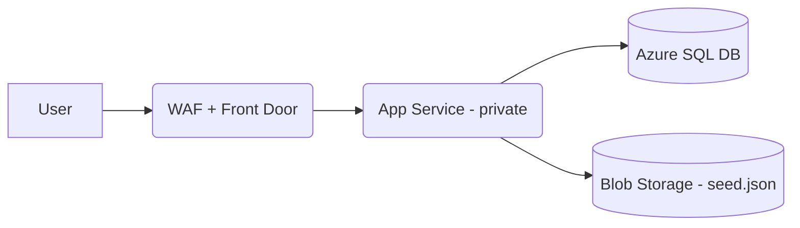

# Famous Quotes – Azure Technical Challenge

## Overview
This project implements a small **public web app hosted in Azure** that returns a random famous quote from an **Azure SQL Database**.  
It was built as part of a time‑boxed challenge (~5h target). The solution emphasizes **security, availability, and production‑ready design**.


## 🌐 Architecture Overview

- **Azure Front Door** – Global entry point with HTTPS + WAF policy  
- **Private App Service (Linux, .NET 8)** – Only accessible via Front Door (locked inbound)  
- **Azure SQL Database** – Secured with **Managed Identity** authentication, no passwords (PII Data) 
- **Azure Storage (Blob)** – Stores JSON seed file with initial quotes  (Seeds if DB is Empty)
- **Private Endpoints + VNet Integration** – Ensures all traffic stays inside Azure backbone  
- **Monitoring** – Application Insights, availability test, alerts wired (basic)  



---

## 🚀 Deployment Guide

---

## Prerequisites
- Azure subscription with Owner/Contributor access
- [Terraform](https://developer.hashicorp.com/terraform/downloads)
- [Azure CLI](https://learn.microsoft.com/en-us/cli/azure/install-azure-cli)
- [.NET 8 SDK](https://dotnet.microsoft.com/en-us/download/dotnet/8.0)

---

## Bootstrap

### 1. Bootstrap Terraform remote state
```bash
cd bootstrap
./provision-terraform-state.zsh
```
This creates a **storage account + container** to hold the Terraform remote state.

---

### 2. (Optional) Purchase and configure domain
```bash
./purchase-app-service-domain.zsh
```
Provision an Azure‑managed domain and delegate DNS.  
*Optional – skip if you don’t need a custom domain.*

---

## Infrastructure Deployment

### 3. Set variables
Edit `infra/envs/dev/variables.tfvars` with your project name, location, and DNS zone.

### 4. Deploy infrastructure
```bash
cd infra/envs/dev
terraform init -backend-config=backend.conf
terraform apply -var-file=variables.tfvars
```

This provisions:
- RG, VNet, subnets
- Azure SQL server + DB
- App Service Plan + Linux Web App
- Private Endpoint + Private DNS Zone
- Azure Front Door (apex + www redirect, TLS)
- Application Insights

---

## Data & Identity Setup

### 5. Upload seed quotes
Upload `quotes.json` into the seed blob container:
```bash
az storage blob upload   --account-name <storage-name>   --container-name seed   --file app/sql/quotes.json   --name quotes.json
```
> ⚠️ Quotes are treated as **PII** for this challenge.

---

### 6. Grant Managed Identity DB access
Run `app/sql/setup-managed-identity.sql` against both **master** and **db-famousquotes-dev**:
```sql
-- master DB (safe no-op)
CREATE USER [app-famousquotes-dev] FROM EXTERNAL PROVIDER;

-- in db-famousquotes-dev
CREATE USER [app-famousquotes-dev] FROM EXTERNAL PROVIDER;
ALTER ROLE db_datareader ADD MEMBER [app-famousquotes-dev];
ALTER ROLE db_datawriter ADD MEMBER [app-famousquotes-dev];
ALTER ROLE db_ddladmin ADD MEMBER [app-famousquotes-dev]; -- required to CREATE TABLE
```

---

## App Deployment

### 7. Build & publish
```bash
dotnet publish -c Release -o publish app/src/FamousQuotes.Api
```

### 8. Deploy via zip
```bash
az webapp deploy   --resource-group rg-famousquotes-dev   --name app-famousquotes-dev   --src-path publish   --type zip
```

---

## Test

- Health probe:  
  `https://<frontdoor-hostname>/healthz`
- Random quote:  
  `https://<frontdoor-hostname>/`

---

## Operations

- **Logs & metrics:** Application Insights
- **Alerts:** Availability test + sample metric alert (attach Action Group to send notifications)
- **Cleanup:**  
  ```bash
  terraform destroy -var-file=variables.tfvars
  ```

---

## Next Steps (>5h improvements)

- **Terraform state hardening** (effort: ~1.5h)  
  - Geo‑redundant storage (GRS/ZRS)  
  - Blob soft‑delete & immutability  
  - Network isolation (private endpoints for state)

- **CICD pipelines** (~2h)  
  - GitHub Actions for infra + app deploy  
  - Automate MI → SQL user creation

- **Platform vs app split** (~2h)  
  - Core infra (network, SQL, FD profile, plans) reusable across projects  
  - App slice only deploys vertical: domain, routes, app, private links

- **Resilience** (~2h)  
  - Secondary App Service Plan in paired region  
  - Blue/green or active/active routing with FD

- **SQL tier & redundancy** (~1.5h)  
  - Zone redundant tier (Business Critical) for higher SLA

- **Security & observability** (~2h)  
  - WAF policies (headers, rate limiting)  
  - Action Groups → email/SMS/Teams alerts  
  - Cost alerts

---

## Time Breakdown (~5h target)

- Hour 1: Design, Terraform skeleton, remote state
- Hour 2: Core infra (SQL, App Service, network, private link)
- Hour 3: Front Door, DNS, HTTPS, App Insights
- Hour 4: .NET API, seeding logic (DB + Blob via MI)
- Hour 5: Docs, alerts, polish

> First Terraform project: delivered **48 Azure resources** with private networking, MI, PII handling, monitoring, and secure ingress (Front Door only).

---

## Cost Snapshot (AU East)

- App Service Plan P1v3: ~AUD 200/mo  
- Azure SQL S0: ~AUD 20/mo  
- Storage + DNS + Insights + Front Door: ~AUD 50–80/mo  
**≈ AUD 270–300/mo total** (dev‑grade).  
*Production SLA upgrade: Zone‑redundant SQL + App Service scaling.*

---

## Use of AI
- **Codegen:** Bootstrapped .NET seeding logic, SQL MI access, Terraform fixes
- **Debugging:** Azure provider errors, App Service VNet quirks
- **Design partner:** sanity‑checked architecture, identified blind spots
- **Productivity:** kept a running log + time budget
- **Mindset:** AI was used to **accelerate delivery**, not replace engineering judgment

---
