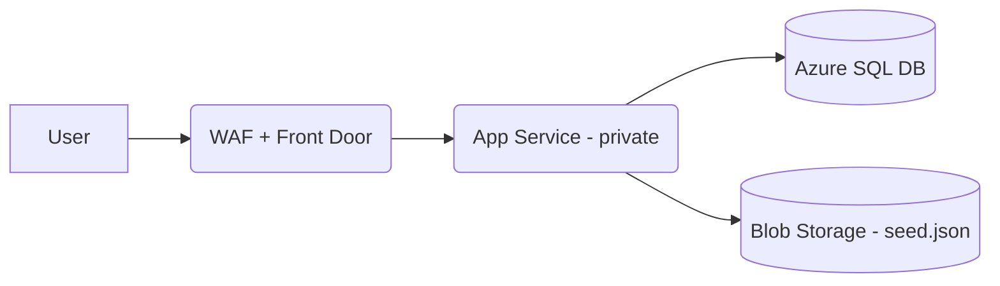

# Famous Quotes – Azure Reference App

This project demonstrates a **secure, production-grade stack on Azure** for a small public web app that serves random quotes from a SQL database.  
It was designed as a 5-hour technical exercise with a focus on **security, availability, and clean architecture**.

---

## 🌐 Architecture Overview

- **Azure Front Door** – Global entry point with HTTPS + WAF policy  
- **Private App Service (Linux, .NET 8)** – Only accessible via Front Door (locked inbound)  
- **Azure SQL Database** – Secured with **Managed Identity** authentication, no passwords  
- **Azure Storage (Blob)** – Stores JSON seed file with initial quotes  
- **Private Endpoints + VNet Integration** – Ensures all traffic stays inside Azure backbone  
- **Monitoring** – Application Insights, availability test, alerts wired (basic)  



---

## 🚀 Deployment Guide

### 1. Prerequisites
- Azure CLI + logged in (`az login`)  
- Terraform installed (v1.6+)  
- .NET 8 SDK installed  

### 2. Deploy Infra
```bash
cd infra
terraform init
terraform apply
```

This provisions: RG, VNet, App Service Plan, App Service, SQL DB, Storage, Front Door.

### 3. Deploy App
```bash
dotnet publish -c Release -o publish app/src/FamousQuotes.Api
az webapp deploy   --resource-group rg-famousquotes-dev   --name app-famousquotes-dev   --src-path publish --type zip
```

### 4. Enable DB Access via Managed Identity
```bash
az sql server ad-admin create   --resource-group rg-famousquotes-dev   --server sql-famousquotes-dev   --display-name "AzureAD Admin"   --object-id <YOUR_AAD_OBJECT_ID>

az sql db execute   --name db-famousquotes-dev   --server sql-famousquotes-dev   --resource-group rg-famousquotes-dev   --command "CREATE USER [app-famousquotes-dev] FROM EXTERNAL PROVIDER; ALTER ROLE db_datareader ADD MEMBER [app-famousquotes-dev]; ALTER ROLE db_datawriter ADD MEMBER [app-famousquotes-dev];"
```

### 5. Test It
- Open the Front Door URL → should return random quotes.  
- `/healthz` endpoint available for probes.  

---

## 📌 Next Recommended Steps (if >5h)

### Terraform State Reliability
- [ ] Enable **GEO-Redundant Storage (GRS)** – Effort ~1h  
- [ ] Enable **Blob Soft Delete / Versioning** – Effort ~1h  
- [ ] Lock state storage behind **VNet / Private Endpoint** – Effort ~1.5h  
- [ ] Enable **Storage Account Firewall + Defender** – Effort ~1h  

### Architecture Roadmap
- CI/CD with **GitHub Actions** – infra + app deploy (~2h)  
- Split **core infra (network, sql, plans)** vs **product slice (routes, domain)** (~2h)  
- Blue/Green deployments with **paired region App Service Plan** (~2.5h)  
- Automate Managed Identity SQL setup via pipeline SPN (~1.5h)  
- Zone-redundant SQL for higher SLA (~1h)  
- Action Groups for alerting (~1h)  

---

## 📊 SLA & Cost Considerations

- **App Service Plan (P1v3 Linux)** – 99.95% SLA  
- **SQL Database (General Purpose, zone redundant)** – 99.99% SLA  
- **Front Door Premium** – 99.99% SLA  
- Current stack ≈ **~$250–300/month (dev)**  
- With full prod hardening (GRS, redundancy, paired region) ≈ **~$800/month**  

---

## 🤖 AI Usage

AI was used strategically to **accelerate delivery**, not replace engineering judgment:
- Drafted Terraform snippets and fixed provider issues  
- Helped design **Managed Identity** auth flow for .NET + SQL  
- Debugged deployment errors faster  
- Generated docs, visuals, and tracked time  
- Served as a sounding board for architecture trade-offs  

Recruiter takeaway: *"He uses AI as a multiplier to deliver faster, but knows the details and can explain the system end-to-end."*

---

## ⏱️ Time Breakdown (5h cap)

**Hour 1** – Infra design (RG, VNet, SQL, App, Storage, Front Door) in Terraform  
**Hour 2** – Build initial .NET API + seeding logic  
**Hour 3** – Add MI-based SQL auth + Blob ingestion  
**Hour 4** – Private links, inbound lockdown, monitoring + alerts  
**Hour 5** – Docs, polishing, README, AI-assisted review  

---

## ✅ Focus Achieved

- Security: private App Service, MI auth, no secrets  
- Availability: Front Door global edge, SQL SLA-backed  
- Monitoring: logs + signals captured  
- Scalability: app plan and SQL are elastic  
- Governance: IaC-driven, ready for pipeline automation  

---

*First Terraform project → deployed **48 resources** across network, SQL, App, Front Door, MI.*  
This demonstrates **full-stack Azure engineering** from governance down to code.

---
