# 🌟 Famous Quotes Challenge

> End-to-end **Azure cloud-native app** deployed with Terraform, .NET 8, Managed Identity, and Front Door.  
> Built with focus on **security, availability, IaC best practices**, and **production-grade design**.

---

## 🏗️ Architecture

```mermaid
flowchart TD
    A[GitHub Repo 💻] -->|Bootstrap| B[Terraform Remote State ☁️]
    B --> C[Terraform Infra ⚙️]
    C -->|Creates| D[(SQL Database 🗄️)]
    C --> E[(Blob Storage 📦)]
    C --> F[(App Service Plan + Web App 🚀)]
    C --> G[(Azure Front Door 🌍)]
    F --> D
    F --> E
    G --> F
    E -->|Seed quotes.json| D
```



- **SQL Database** (with table auto-created on first run)
- **Blob Storage** (holds `quotes.json` seed, treated as PII)
- **App Service** (.NET 8 Web API, private, only exposed via Front Door)
- **Managed Identity** (no secrets, app connects to SQL via MSI)
- **Terraform Remote State** (secure, versioned, redundant)
- **Optional Domain**: `myfamousquotes.net`

---

## ⚡ Quickstart

### 0. Bootstrap (one-time per subscription)

Provision Terraform state storage and (optionally) purchase domain:

```bash
cd bootstrap
./provision-terraform-state.zsh famousquotes australiaeast
./purchase-app-service-domain.zsh myfamousquotes.net australiaeast contact.json
```

This creates:
- RG: `rg-terraform-state`
- SA: `stfamousquotestfstate`
- Container: `tfstate`
- (Optional) Domain + DNS zone in `rg-app-domains`

---

### 1. Deploy Infra

```bash
cd infra/envs/dev
terraform init -backend-config=../../backend.hcl
terraform apply -auto-approve
```

Creates **48+ Azure resources** including SQL DB, Storage, App Service, Front Door.

---

### 2. Upload Seed Quotes

> Treat `quotes.json` as **PII data**.  

Upload initial dataset to Blob:

```bash
az storage blob upload   --account-name stfamousquotesdev   --container-name seed   --name quotes.json   --file {your local folder}/quotes.json   --auth-mode login
```

---

### 3. Enable DB Access via Managed Identity

Grant App Service MI access to SQL: (To be Automated, Script available in /app/sql)

```sql
-- run in db-famousquotes-dev
CREATE USER [app-famousquotes-dev] FROM EXTERNAL PROVIDER;
ALTER ROLE db_datareader ADD MEMBER [app-famousquotes-dev];
ALTER ROLE db_datawriter ADD MEMBER [app-famousquotes-dev];
ALTER ROLE db_ddladmin ADD MEMBER [app-famousquotes-dev];
```

---

### 4. Deploy App

Publish + zip:

```bash
dotnet publish -c Release -o publish app/src/FamousQuotes.Api
pushd publish && zip -r ../app.zip . && popd
```

Deploy to App Service:

```bash
az webapp deploy   --resource-group rg-famousquotes-dev   --name app-famousquotes-dev   --src-path app.zip   --type zip
```

---

### 5. Test

```bash
curl https://myfamousquotes.net/
```

✅ Returns a random seeded quote.  
If DB is empty, app pulls from Blob and seeds automatically.

---

## 🚀 Next Recommended Steps (+5h work)

If I had more time, I’d add:

- **Terraform State Reliability**:
  - GRS/ZRS redundancy (1.5h)
  - Immutability lock & blob soft delete (0.5h)
  - VNet/private endpoint for state (2h)
- **App Lifecycle Improvements**:
  - GitHub Actions CI/CD (2h)
  - Split “core infra” (network, SQL, plans, FD) into separate reusable project (2h)
  - FamousQuotes only deploys its **vertical slice** (domain, routes, app service)
- **High Availability**:
  - Paired region App Service Plan + blue/green deploy (3h)
  - Zone redundancy for SQL (2h)
- **Automation**:
  - Managed Identity SQL user creation automated in pipeline (1h)
  - Action Groups for alerting (1h)

---

## 🤖 How I Used AI

- **Code generation**: scaffolding `.NET` services, DbInitializer, seeding logic.  
- **Troubleshooting**: Terraform/Azure provider errors, MSI SQL connection issues.  
- **Design partner**: validated architecture choices, brainstormed +5h improvements.  
- **Productivity**: tracked time, kept logs, polished documentation.  

> I didn’t use AI to “do my work for me” — I used it to **go faster**, stay unblocked, and deliver production-grade results.  
> I can explain every line of code and every infra choice.

---

## ⏱️ Time Breakdown (5h total cap)

- **Hour 1**: Design + bootstrap (Terraform state, domain purchase).  
- **Hour 2**: Infra modules (SQL, App Service Plan, Front Door, VNet integration).  
- **Hour 3**: .NET app (Program.cs, MSI SQL auth, seeding logic, Blob integration).  
- **Hour 4**: Wiring monitoring + alert rules (signals in place, action groups pending).  
- **Hour 5**: Documentation, polish, diagrams, README.

---

## ⚙️ Choices & SLAs

- **App Service Linux Plan (S1)** → 99.95% SLA  
- **SQL Single DB (GP, zone redundant optional)** → 99.99% SLA  
- **Front Door** → global edge HA, 99.99% SLA  
- **Storage (LRS, upgradable)** → 99.9% SLA

> Current stack SLA: ~99.95%.  
> Next tier: SQL ZRS + App Service in paired region → 99.99%+.

---

## 💸 Cost (monthly, approx AU East)

- App Service Plan (S1) → ~AUD 110  
- SQL Database (GP S0) → ~AUD 20  
- Storage Account (LRS) → ~AUD 5  
- Front Door → ~AUD 40  
- Domain → ~AUD 20/yr

👉 Total ~ **AUD 175/month**

---

# ✅ Summary

- 48+ Azure resources deployed with Terraform.  
- .NET app with **Managed Identity SQL auth**.  
- Quotes seeded from **Blob Storage (PII-aware)**.  
- Private App Service, only exposed via Front Door.  
- Monitored, secure, available.  
- Documented and production-ready.  
